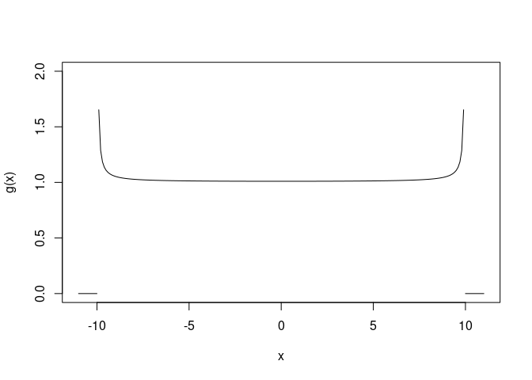
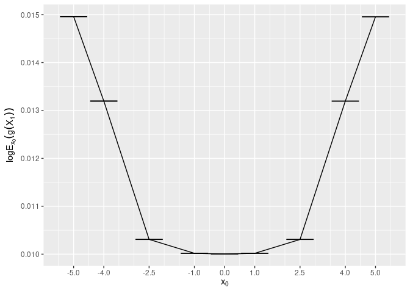
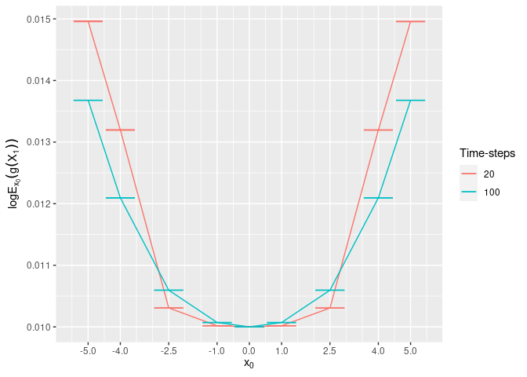
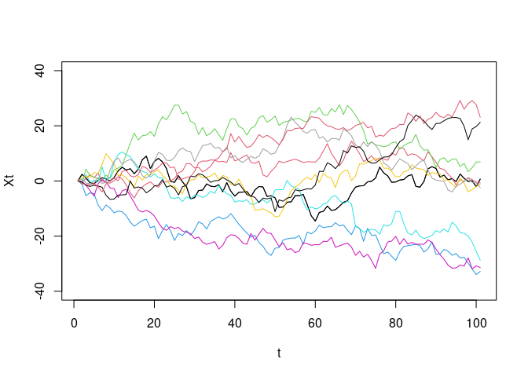

README
================

<!-- README.md is generated from README.Rmd. Please edit that file -->

# SC2GroupProject

<!-- badges: start -->
<!-- badges: end -->

The goal of SC2GroupProject is to Perform SMC sampling in order to
approximate expectations of interest for diffusions processes.

## Installation

You can install the development version of SC2GroupProject from
[GitHub](https://github.com/joshgivens) with:

``` r
# install.packages("devtools")
devtools::install_github("joshgivens/SC2GroupProject")
```

## Main Problem

Here is the R code required to compute the statistics of interest for
our problem

``` r
library(SC2GroupProject)

#Set our final timepoints
Final_T=1
#Set number of timesteps we will use
timesteps=20
#Get the size of each timestep
step=Final_T/timesteps

#Create sampling function
sampler <- function(x_0){
  sin_samp(1,x_0,step,pi)
}

# Create Likelihood Function
true_lik <- function(x,x_0){
  sin_lik(x,x_0,step,pi)
}

# Create g function
g <- function(x){
  zeta <- 100
  omega2 <- 1e-30
  diff=sqrt(zeta)-omega2
  if(x>-diff & x<diff){
    return(
      exp(1/(zeta-x^2))
    )
  }
  else{
    return(0)
  }
}
```

Now we have set up we can use this to approximate our expectation of
interest. We first do this with 1,000 samples starting at
.

``` r
#Simulate 1,000 particles
out <- diff_SMC(g=g,p_delta=true_lik,M_T_samplers = rep(list(sampler),timesteps),
         M_T_lik = rep(list(true_lik),timesteps), n = 1000, timesteps = timesteps,
         varphi = 0.9,x_0=1,resample = T)
```

Now we have performed the sampling we can calculate the normalising
constant of this distribution using the `harmonic_norm` and `basic_norm`
functions.

``` r
log(harmonic_norm(out$gmat[,timesteps],out$Wmat,0.9))
#> [1] 0.01001811
log(basic_norm(out$Wmat))
#> [1] 0.009016305
```

Both these give approximations of
)")
with
.
For illustration, below is the plot of the function

on
")

``` r
x <- seq(from=-10+1e-15,to=10-1e-15,by=0.1)
y=rep(NA,length(x))
for(i in 1:length(x)){
  y[i] <- g(x[i])
}
plot(x,y,type="l",ylim=c(0,2),xlim=c(-11,11),xlab="x",ylab="g(x)",main="")
lines(c(10,11),y=c(0,0))
lines(-c(10,11),y=c(0,0))
```



As well as an R implementation of this sampler we have included a C++
implementation which is significantly quicker. This implementation is
specialised to this exact case and can be found in the function
`diff_SMC_sin`.

First we demonstrate that it does indeed estimate the same procedure

``` r
out_cpp <- diff_SMC_sin(x_0=1,t=step,n=10000,timesteps=timesteps,varphi=0.9,TRUE)
out <- diff_SMC(g=g,p_delta=true_lik,M_T_samplers = rep(list(sampler),timesteps),
         M_T_lik = rep(list(true_lik),timesteps), n = 10000, timesteps = timesteps,
         varphi = 0.9,x_0=1,resample = T)


log(harmonic_norm(out$gmat[,timesteps],out$Wmat,0.9))
#> [1] 0.01001807
log(harmonic_norm(out_cpp$gmat[,timesteps],out$Wmat,0.9))
#> [1] 0.01001794
```

We now show that this process gives significant speed increases

``` r
library(microbenchmark)
options(microbenchmark.unit="relative")
microbenchmark(C_version = diff_SMC_sin(x_0=1,t=step,n=10000,timesteps=timesteps,varphi=0.9,TRUE),
               R_version = diff_SMC(
                 g=g,p_delta=true_lik,M_T_samplers = rep(list(sampler),timesteps),
                 M_T_lik = rep(list(true_lik),timesteps), n = 10000, timesteps = timesteps,
                 varphi = 0.9,x_0=1,resample = T),
               times = 10)
#> Unit: relative
#>       expr      min       lq     mean  median       uq      max neval
#>  C_version  1.00000  1.00000  1.00000  1.0000  1.00000  1.00000    10
#>  R_version 30.50787 28.52529 28.39146 28.2005 27.70722 27.87073    10
```

We see that the C++ versions is almost 30 times faster which is
impressive. We now use this to perform approximations for various values
of
,

``` r
library(dplyr)
#> 
#> Attaching package: 'dplyr'
#> The following objects are masked from 'package:stats':
#> 
#>     filter, lag
#> The following objects are masked from 'package:base':
#> 
#>     intersect, setdiff, setequal, union
x_0s <- c(-5,-4,-2.5,-1,0,1,2.5,4,5)
set.seed(1234)
Preds <- data.frame(x_0=numeric(),sample=numeric(),estimate=numeric())
for (i in 1:length(x_0s)){
  for (j in 1:10){
    out <- diff_SMC_sin(x_0=x_0s[i],t=step,n=10000,timesteps=timesteps,varphi=0.9,TRUE)
    pred <- log(harmonic_norm(out$gmat[,timesteps],out$Wmat,0.9))
    Preds <- Preds %>% add_row(x_0=x_0s[i],sample=j,estimate=pred)
  }
}
```

We now plot the estimations alongside there standard deviations.

``` r
library(ggplot2)
Preds_sum <- Preds %>% group_by(x_0) %>% 
  summarise(mean=mean(estimate),
            sd=sd(estimate),
            upper=mean+sd,lower=mean-sd)

ggplot(Preds_sum,aes(x=x_0,y=mean,ymin=lower,ymax=upper))+geom_line()+
  geom_errorbar()
```



We can additionally try more time-points and see if that varies our
prediction. We now try with 100 time-steps giving


``` r
Preds2 <- Preds %>% mutate(timesteps=20)
for (i in 1:length(x_0s)){
  for (j in 1:10){
    out <- diff_SMC_sin(x_0=x_0s[i],t=1/100,n=10000,timesteps=100,varphi=0.9,TRUE)
    pred <- log(harmonic_norm(out$gmat[,timesteps],out$Wmat,0.9))
    Preds2 <- Preds2 %>% add_row(x_0=x_0s[i],sample=j,estimate=pred,timesteps=100)
  }
}
```

No plot the 2 against one another.

``` r
Preds_sum2 <- Preds2 %>% group_by(timesteps,x_0) %>% 
  summarise(mean=mean(estimate),
            sd=sd(estimate),
            upper=mean+sd,lower=mean-sd)
#> `summarise()` has grouped output by 'timesteps'. You can override using the
#> `.groups` argument.

ggplot(Preds_sum2,aes(x=x_0,y=mean,ymin=lower,ymax=upper,colour=factor(timesteps)))+geom_line()+
  geom_errorbar()
```

 \#
Additional Content \## True Samplers As well as the implementations
shown above we have various other functions which can help with SMC.
First of all we have implemented a method to do direct discrete sampling
as well the the exact transition kernels for both Brownian Motion and
Ornstein-Uhlenbeck Process.

Here is an example of various simulated particles from Brownian Motion.

``` r
true_sampler <- function(x_0){
  brown_samp(1,x_0,t=1,sigma=2)
}

out_true <- discrete_sampler(true_sampler,x_0=0.01,timesteps = 100,n=10)

plot(out_true[1,],type="l", ylim=c(-40,40),xlab="t",ylab="Xt")
for (i in 1:10){
  lines(out_true[i,],col=i)
}
```

 \##
Standard SMC We have also implemented a standard SMC sampler for use
with any diffusions process

Below is a demonstration of using a Brownian Motion to generate samples
from and Ornstein-Uhlenbeck process with
.

``` r
Final_T=1
timesteps=100
step=Final_T/timesteps

init_sample <- function(n){
  brown_samp(n,1,step,sigma=1)
}

sampler <- function(x_0){
  brown_samp(1,x_0,step,sigma=1)
}

true_sampler <- function(x_0){
  ornuhl_samp(1,x_0,step,alpha=1,sigma=1)
}

prop_lik <- function(x,x_0){
  brown_lik(x,x_0,step,sigma=1)
}

true_lik <- function(x,x_0){
  ornuhl_lik(x,x_0,step,alpha = 1,sigma=1)
}
```

Now we generate the process.

``` r
# Generate y using exponential with shape parameter x^2
x_0 <- 1
hidden_x <- rep(NA,timesteps)
hidden_x[1] <- true_sampler(x_0)
# Generate hidden x sample
for(i in 2:100){
  hidden_x[i] <- true_sampler(hidden_x[i-1])
}

y=rexp(timesteps,rate=hidden_x^2)

g_lik <- function(y,x){
  dexp(y,rate=x^2)
}
```

``` r
out <- Basic_SMC(init_sample=init_sample, 
                 proposal_sample=sampler, 
                 proposal_lik = prop_lik,
                 true_lik=true_lik,
                 g_lik=g_lik,
                 y=y,
                 n=1000,
                 timesteps=timesteps)
```

## Non-reweighted approach

There is also an option in both `diff_SMC` and `diff_SMC_sin` to not do
re-sampling and simply compound the weights. This is generally note
recommended as it can lead to degeneracy in the weights and other
issues.

We can see this here as not using re-sampling leads to higher variance
in the end weights?

``` r
#Set our final timepoints
Final_T=1
#Set number of timesteps we will use
timesteps=20
#Get the size of each timestep
step=Final_T/timesteps

#Create sampling function
sampler <- function(x_0){
  sin_samp(1,x_0,step,pi)
}

# Create Likelihood Function
true_lik <- function(x,x_0){
  sin_lik(x,x_0,step,pi)
}

g <- function(x){x^2}


#Simulate 1,000 particles
out_resamp <- diff_SMC(g=g,p_delta=true_lik,M_T_samplers = rep(list(sampler),timesteps),
         M_T_lik = rep(list(true_lik),timesteps), n = 1000, timesteps = timesteps,
         varphi = 0.9,x_0=1,resample = TRUE)
#Simulate 1,000 particles
out_nonresamp <- diff_SMC(g=g,p_delta=true_lik,M_T_samplers = rep(list(sampler),timesteps),
         M_T_lik = rep(list(true_lik),timesteps), n = 1000, timesteps = timesteps,
         varphi = 0.9,x_0=1,resample = FALSE)

# This is not what we would expect.
var(out_resamp$Wmat[,timesteps])
#> [1] 0.2671712
var(out_nonresamp$Wmat[,timesteps])
#> [1] 0.01669416
```
